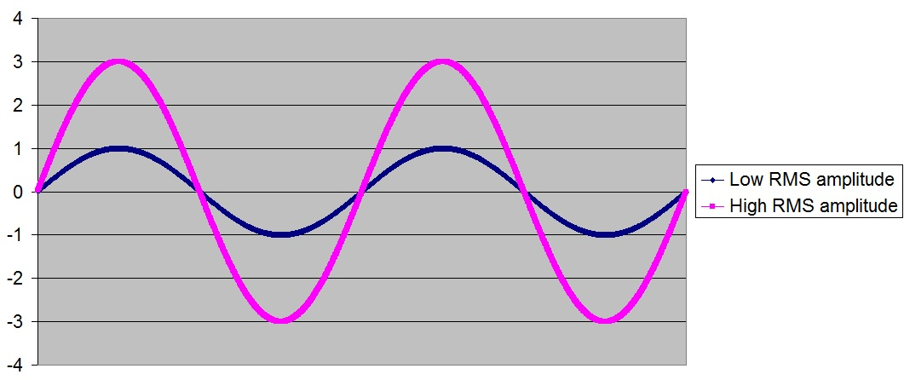

Week 7: Finishing up Curriculum, Sort of…

## Sharing an Earsketch Script

~Open the Script Browser

Click the Script you would like to share

~Click the button to the right of the script name

~A Drop Down menu of options will show up

~Click Share

~Choose the License and then click the Shareable Link; the share window already gives you the option to share your creation on Soundcloud

## Optional Stuff that was interesting to learn

Sounds are analyzed in different ways, through amplitude and frequencies
High Amplitude= Loud
Low Amplitude= Soft



To analyze a musical clip:

`var rmsAmplitude = anaylze(whatToAnalyze, analysisMethod);`

Another way to analyze music is through Spectral Centroid which is just another way to measure loudness and frequencies

## Visualization

~ While creating music is fun, there is this really cool feature where you can make musical videos where the colors and shapes react to your music the way to create these visualizations is through RGB Color and Hex Notation


### RGB Color and Hex Notation

~ The most common color breakdown is using three colors Red, Green, Blue (RGB) these colors will combine and create one final color onto the screen. The range of values goes from 0 which has no intense and doesn’t use a lot of that color and 255 which uses that color at it’s most intense value

```JavaScript
//fits visual to screen(entire canvas)
drawRectangle(0,0,getCanvasWidth(),getCanvasHeight(),"#FF0000");
```

~ Using the features onLoop() and getAmplitude() are the main components when making graphics to react to music; onLoop() allows the creation to flow smoothly and getAmplitude() grabs the loudness of where the song is at the time

# Take-Aways

~ Focus more on the product and the task rather than making it look pretty, if you focus on the visuals more you may miss something when rushing through to create the song, in this case you need the music before the visual. With any form of creation you should work on the main idea and pay attention to what it’s supposed to do and how it’s supposed to work, “Done is better than perfect”-Mr.Mueller, It took a while but the more projects I create with a front end I understand what it means. In Earsketch you don’t need to always have a front end(visualization) but it’s nice to have it with the music.
